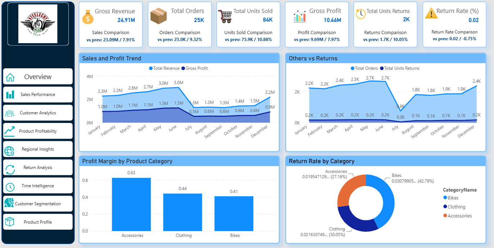
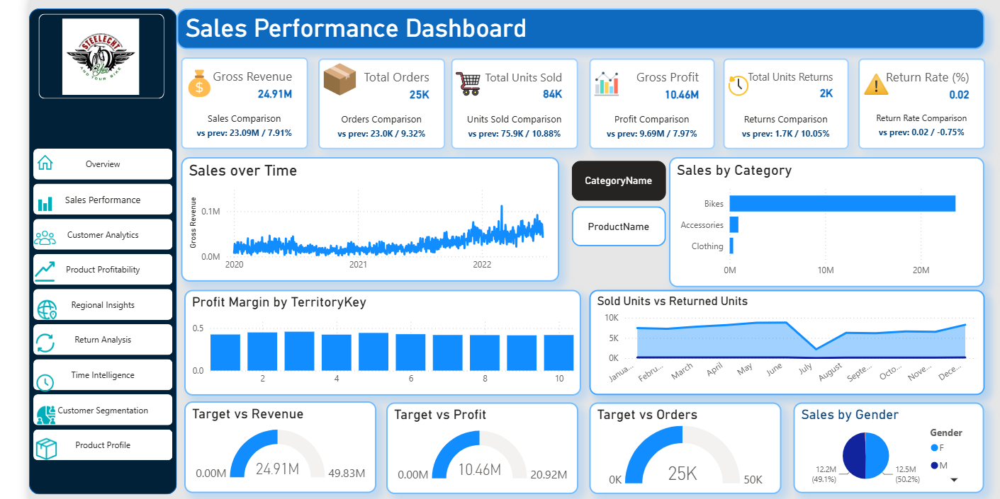
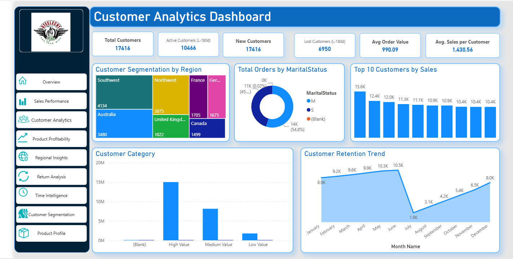
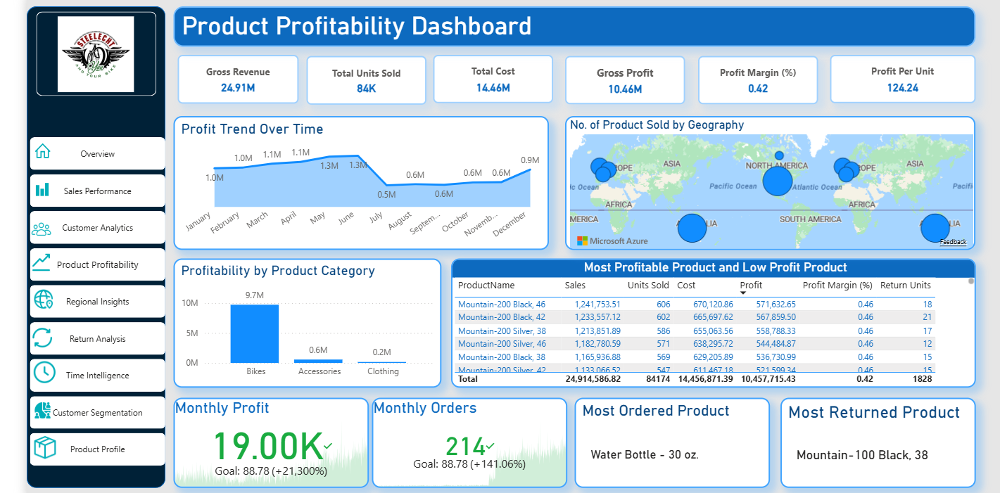
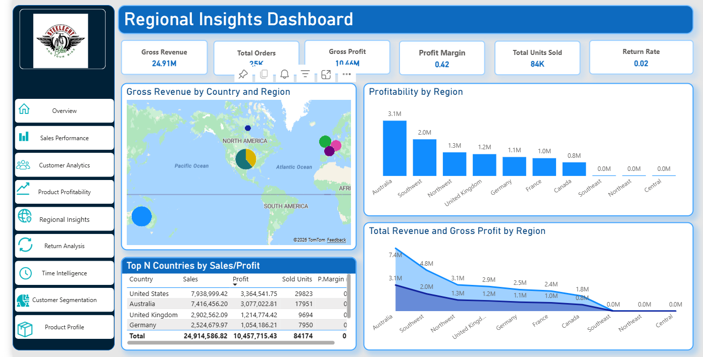
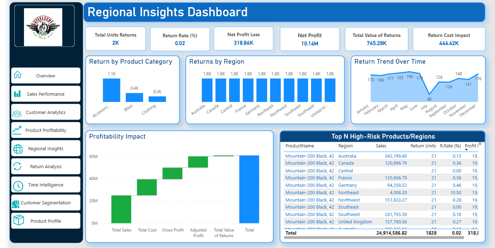
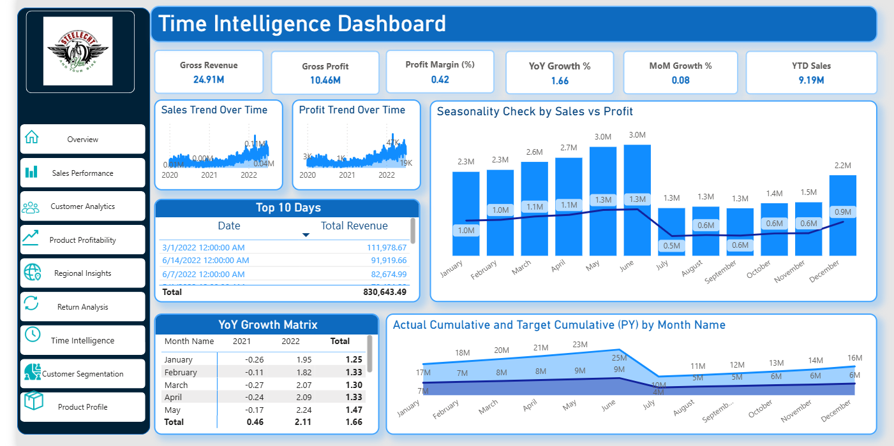
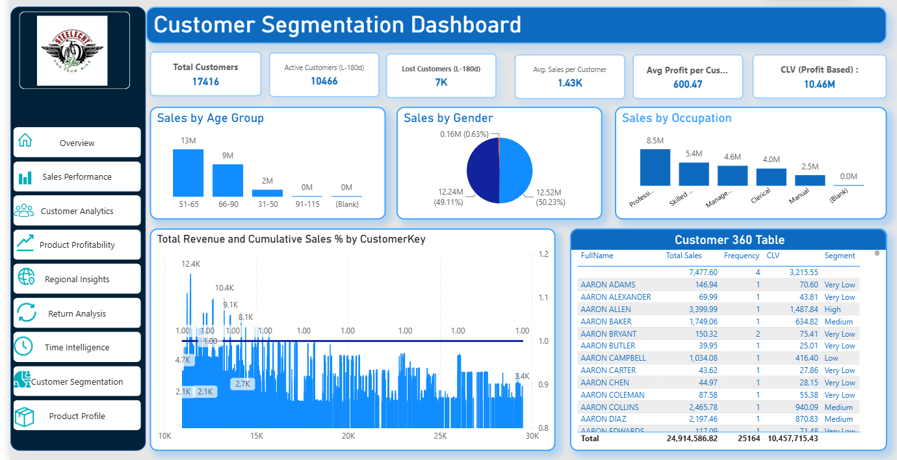
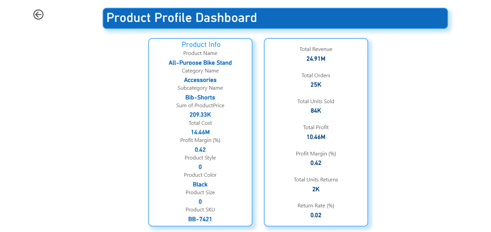

# 📊 E-Commerce Sales Analytics Dashboard

### 🔍 Project Overview
The **E-Commerce Sales Analytics Dashboard** is an interactive Power BI solution designed to provide deep insights into sales, profitability, customer behavior, and product performance across multiple dimensions.  
This project demonstrates advanced data modeling, DAX measures, and visual storytelling to support business decision-making through a dynamic and professional dashboard interface.

---

### 🧠 Objectives
- Track and visualize **total sales, profit, and return performance** across time and regions.  
- Analyze **customer segmentation and retention patterns** to identify high-value groups.  
- Evaluate **product-level profitability** and understand return cost impacts.  
- Provide **executive-level KPIs** for quick strategic insights.

---

### 🧩 Data Model Structure

**Data Sources**
- `SalesData2020` – Transactional sales records  
- `ReturnData` – Returned item details  
- `CustomerInformation` – Demographic and behavioral data  
- `ProductInformation`, `ProductCategory`, `ProductSubCategory` – Product hierarchy and attributes  
- `TerritoryLookup` – Region and country mapping  
- `Calendar` – Time intelligence and period-based analysis  

**Relationships**
- Star schema with `SalesData2020` as the fact table  
- Dimension tables: `CustomerInformation`, `ProductInformation`, `TerritoryLookup`, `Calendar`  

---

### ⚙️ Key DAX Measures
- `Total Sales` = SUMX(SalesData, SalesData[OrderQuantity] * RELATED(ProductInformation[ProductPrice]))  
- `Total Profit` = [Total Sales] - [Total Cost]  
- `Profit Margin (%)` = DIVIDE([Total Profit], [Total Sales])  
- `Return Rate (%)` = DIVIDE([Total Units Returns], [Total Units Sold])  
- `YoY Growth`, `MoM Growth`, `YTD Sales`, `Customer Lifetime Value (CLV)`  
- Dynamic measures for **Target vs Actual**, **Retention**, and **Profit Impact**

---

### 🖥️ Dashboard Pages and Insights

#### 1. **Overview**
- Executive summary KPIs: Revenue, Profit, Orders, Return Rate  
- Year-over-Year and Month-over-Month performance overview  
- High-level visualization of sales and profitability trends
  

#### 2. **Sales Performance**
- Time-series analysis of sales and orders  
- Product category contribution  
- Target vs Actual performance visualization
  

#### 3. **Customer Analytics**
- Total and active customers, new vs lost customer metrics  
- Top 10 customers by sales  
- Customer retention trend and behavior analysis
  

#### 4. **Product Profitability**
- Profit margin by product and category  
- Top and low-performing products  
- Profit per unit and product return impact  

#### 5. **Regional Insights**
- Sales and profit distribution by region and country  
- Map visualization for geographic performance  
- Top-performing markets
  

#### 6. **Returns Analysis**
- Total value of returns and profit loss impact  
- High-risk products and regions  
- Adjusted profit after return deduction
  

#### 7. **Time Intelligence**
- Year-to-Date (YTD) and Month-to-Date (MTD) sales  
- YoY and MoM comparison charts  
- Seasonal sales and profit trend
  

#### 8. **Customer Segmentation**
- CLV-based customer segmentation  
- RFM (Recency, Frequency, Monetary) pattern visualization  
- Cumulative sales distribution by customer rank
  

#### 9. **Product Profile**
- Drill-through page for product-level deep dive  
- Product cost, sales, profit margin, and return details
  

---
---

### 📈 Business Impact
- Enables stakeholders to identify high-profit regions and customer segments.  
- Provides actionable insights for reducing return rates and increasing profit margins.  
- Supports decision-making for inventory, marketing, and customer retention strategies.  

---

### 🧰 Tools & Technologies
- **Power BI Desktop**  
- **DAX (Data Analysis Expressions)**  
- **Power Query (ETL)**  
- **Star Schema Data Modeling**  
- **Azure Maps & Geo Visualization**

---

## 🙋‍♂️ About Me

I'm passionate about data, product thinking, and solving real-world problems with business intelligence. If you're interested in collaborating or want to discuss the dashboard, feel free to connect!

---

Thanks for checking out my AdventureWorks Internet Sales Analytics – Power BI Dashboard project! 🍽️📊
---

### 📎 License
This dashboard was created for educational and analytical purposes using the **AdventureWorks sample dataset** provided by Microsoft.  
All visualizations and measures were custom-developed for demonstration of BI best practices.

---

